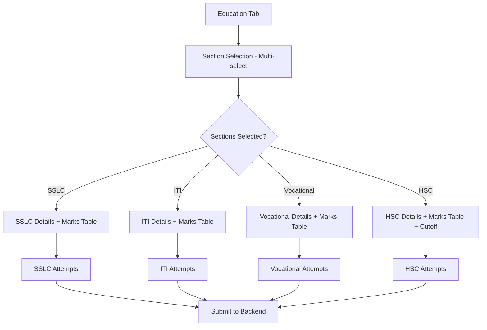

# Educational Details Flow Documentation

This document outlines the complete technical flow for managing educational details within the Student Admission system. This guide is designed to help you recreate the same functionality in a new project.

## 1. Flow Overview

The educational details flow is dynamic and supports four primary education types: **SSLC (10th)**, **ITI**, **Vocational**, and **HSC (12th)**.



---

## 2. Dynamic Section Selection

Users select which education sections to fill using a multi-select dropdown.

### State Management
- `educationSections`: An object tracking visibility.
```javascript
const [educationSections, setEducationSections] = useState({
  sslc: true,
  iti: false,
  vocational: false,
  hsc: false,
});
```

### UI Interaction
The user selects options from:
- **SSLC**: Standard 10th grade.
- **ITI**: Industrial Training.
- **Vocational**: Specialized vocational training.
- **HSC**: Higher Secondary Certificate (12th).

---

## 3. Marks & Subjects Management

Each section contains a dynamic table for subjects.

### Data Structure
Subjects are initialized with default arrays:
- **SSLC**: Tamil, English, Maths, Science, Social Science.
- **HSC**: Choice based on Major/Stream (Biology, Maths, etc.).
- **ITI/Vocational**: Specific trade subjects.

### Logic (Calculation)
When a user enters marks, the system automatically calculates:
- **Total Marks**: Sum of obtained marks.
- **Percentage**: `(Total Marks / Total Max Marks) * 100`.

---

## 4. HSC Specific Logic (Premium Feature)

The HSC section is the most complex, offering specific tools for higher education admission.

### Key Features
1.  **Exam Type**: Toggle between `600` (Modern TN Board) and `1200` (Legacy/Old Board).
2.  **Major/Stream Selection**: 
    - Biology
    - Mathematics
    - Commerce
    - Humanities
3.  **Automatic Cutoff Calculation**:
    - **Biology Formula**: `(Biology / 2) + (Physics / 4) + (Chemistry / 4)`
    - **Mathematics Formula**: `(Maths / 2) + (Physics / 4) + (Chemistry / 4)`

---

## 5. Examination Attempts Flow

For every enabled education section, the system tracks "Attempts" if the student didn't pass in the first try or improved marks.

### The Flow:
1.  **Select Count**: User selects "No. of Attempts" (e.g., 1, 2, 3...).
2.  **Dynamic Generation**: Based on the selection, the UI generates individual "Attempt Cards".
3.  **Fields Captured per Attempt**:
    - **MarkSheet No**: Serial number of the mark sheet.
    - **Exam Reg No**: Candidate registration number.
    - **Month & Year**: When the attempt was taken.
    - **Total Marks**: Marks obtained in that specific attempt.

---

## 6. Implementation Checklist for New Project

### Base Components Needed:
- **React-Select**: For the multi-section picker.
- **Form State**: A robust object to hold nested arrays for subjects and attempts.
- **Change Handlers**:
    - `handleSubjectChange(index, field, value)`: Updates marks and triggers totals.
    - `handleAttemptFieldChange(index, field, value, type)`: Updates specifically for SSLC/ITI/HSC attempts.

### Backend Data Structure:
- **Master Table**: Basic info.
- **Education Table**: Linked by `Application_No`.
- **JSON Storage**: Subjects and Attempts should be stored as JSON strings in the database to handle dynamic arrays efficiently.

### API Integration:
```javascript
// Example Payload Construction
const educationPayload = {
  Application_No: form.appNo,
  educationSections: educationSections,
  sslcSubjects: JSON.stringify(form.sslcSubjects),
  sslcExaminationAttempts: JSON.stringify(form.sslcExaminationAttempts),
  // ... similar for other sections
};
```

---

> [!TIP]
> **Pro-Tip for Reconstruction**: Use the `JSON.parse` helper to safely load subjects from the database. If a student is new, fallback to your `INITIAL_SUBJECT_CONSTANTS`.

> [!IMPORTANT]
> Ensure the `hscMajor` and `hscExamType` handlers reset marks when changed, as the subject list and maximum marks will change completely.
